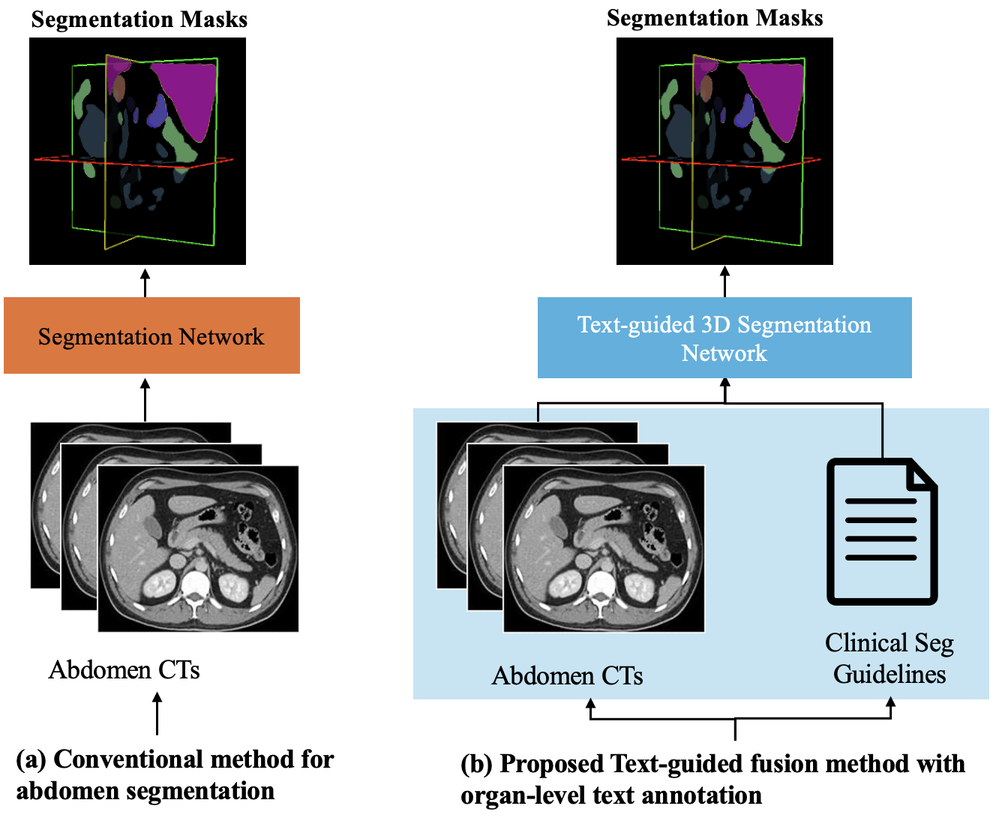
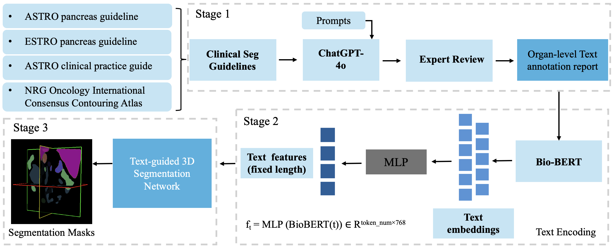

# LLM-Seg

A guideline-informed multimodal framework for text-guided 3D organ-at-risk segmentation in pancreatic SBRT.

---

## Introduction

Our method (**LLM-Seg**) is a text-guided 3D segmentation framework designed to improve organ-at-risk (OAR) delineation for pancreatic cancer stereotactic body radiotherapy (SBRT). Unlike conventional image-only auto-segmentation models, LLM-Seg incorporates clinical contouring knowledge from consensus guidelines into a deep learning segmentation pipeline.

The framework uses large language models to extract organ-level contouring guidance from clinical guidelines, encodes the resulting text with BioBERT, and integrates the text features with CT image features in a Swin Transformer-based 3D segmentation network.

This repository provides the implementation of our guideline-informed multimodal segmentation framework for pancreatic SBRT OAR auto-contouring.

  

---

## Framework Overview

LLM-Seg consists of three main stages:

### Stage 1: Guideline Extraction and Text Annotation

Clinical contouring guidance is extracted from consensus guidelines, including: 1) ASTRO pancreas guideline; 2) ESTRO pancreas guideline; 3) ASTRO clinical practice guideline; and 4) NRG Oncology International Consensus Contouring Atlas.

GPT-4o is used to generate structured organ-level text annotation reports, followed by expert review.

### Stage 2: Text Encoding

The organ-level annotation reports are encoded using BioBERT. The resulting text embeddings are projected into a fixed-length feature representation using a multilayer perceptron (MLP).

### Stage 3: Text-Guided 3D Segmentation

The encoded text features are integrated with CT image features in a 3D segmentation network to guide OAR delineation. The framework is designed to improve segmentation robustness for anatomically complex structures such as the duodenum, stomach, bowel, liver, kidneys, and spinal cord.

  

---

## Features

- Guideline-informed 3D OAR segmentation for pancreatic SBRT
- BioBERT-based clinical text encoding
- Evaluation on public and institutional pancreatic SBRT datasets
- Support for geometric and dosimetric evaluation

---

## Dataset

The framework was developed using CT images from the public TotalSegmentator dataset and externally validated on an institutional pancreatic SBRT cohort. Due to data-sharing restrictions, institutional CT scans and clinical treatment plans are not publicly released.

### Public Dataset

Please download the public CT data directly from the official TotalSegmentator source:

- Download public data from [TotalSegmentator Dataset](https://github.com/wasserth/TotalSegmentator).

---

## Installing Dependencies

Run the following commands to set up the environment:
<pre>conda env create -f environment.yml 
pip install git+https://github.com/Project-MONAI/MONAI.git@07de215c </pre>
If you need to activate the environment, use:
<pre>conda activate LLM-Seg </pre>

If you would like to change the dataset split, please modify the `Train.json` and `Test.json` files accordingly. 

## Training

If you would like to train the model from scratch, you can modify the training code `main.py` and please use the following command:

<pre>python main_Panc.py --distributed --use_ssl_pretrained --save_checkpoint --logdir=LLM-Seg</pre>

- The `--use_ssl_pretrained` option utilizes the pre-trained weights from NVIDIA's Swin UNETR model.
- Download the Swin UNETR pre-trained weights from [Pre-trained weights](https://drive.google.com/file/d/1FJ0N_Xo3olzAV-oojEkAsbsUgiFsoPdl/view?usp=sharing).
- Please place the downloaded weights in the appropriate directory as specified in your configuration or script.

## Inference

We provide our pre-trained weights for direct inference and evaluation.  
Download the weights from [checkpoint](https://drive.google.com/file/d/147283LL2fRDcTYR_vQA-95vbZysjjD1v/view?usp=sharing).

After Training, place the weights in your desired directory, then run the `test.py` with following command for inference:

<pre>python test_Panc.py --pretrained_dir=/path/to/your/weights/ --exp_name=LLM-Seg</pre>

